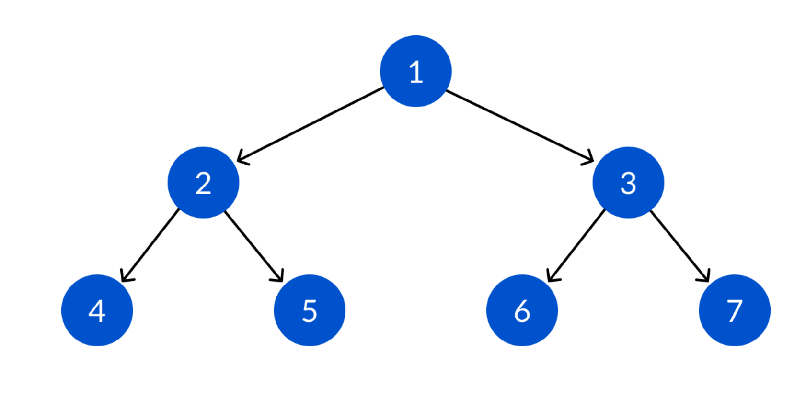

# 깊이 우선 탐색 (Depth-First Search)

## Description

### 입력 설명

자연수 1을 입력값으로 받습니다.

### 출력 설명

전위순회 출력: [1, 2, 4, 5, 3, 6, 7]

중위순회 출력: [4, 2, 5, 1, 6, 3, 7]

후위순회 출력: [4, 5, 2, 6, 7, 3, 1]

3가지 방식으로 출력합니다. 

-> 총 solution 함수가 3개가 됩니다. 전휘순회 solution / 중위 순회 solution / 후위 순회 solution

### 제한 사항

DFS 이론과 재귀함수를 이용합니다.

Follow up: 3개의 함수의 코드 차이가 한 줄 만 차이나도록 해보기 